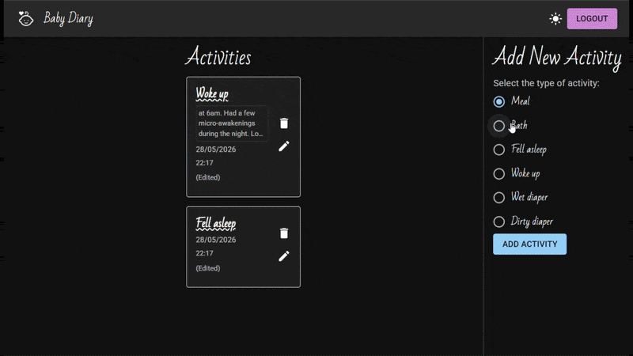

# Baby Diary

A web app to log and track your baby's daily routine — meals, naps, diaper changes, and more — as timestamped entries you can edit or delete. Includes a light/dark theme toggle.



## Tech Stack

### Frontend

- Vite
- React
- TypeScript
- SCSS
- TanStack React Query

### Backend

- Node.js
- Express
- MongoDB

### Authentication

- Auth0

## Prerequisites

Before running the app, make sure you have:

- Node.js installed
- A MongoDB instance (local or hosted, e.g. MongoDB Atlas)
- An Auth0 application and API configured, to supply the domain, client ID, and audience values used below

## Installation and Usage

### Clone the repository

```sh
git clone https://github.com/narasandrade/baby-diary.git
cd baby-diary
```

### Frontend setup

**1. Go to the frontend folder**

```sh
cd baby-diary-frontend
```

**2. Install dependencies**

```sh
npm install
```

**3. Configure environment variables**

Create a `.env` file in the folder, based on `.env.example`:

```sh
VITE_API_SERVER_URL=http://localhost:5000
VITE_AUTH0_DOMAIN=your-tenant.us.auth0.com
VITE_AUTH0_AUDIENCE=your_auth0_api_identifier
VITE_AUTH0_CLIENT_ID=your_client_id
VITE_AUTH0_CALLBACK_URL=http://localhost:5173/
```

**4. Run the application**

```sh
npm run dev
```

**5. Open the app**

```
http://localhost:5173
```

### Backend setup

**1. Go to the backend folder**

```sh
cd ..
cd baby-diary-backend
```

**2. Install dependencies**

```sh
npm install
```

**3. Configure environment variables**

Create a `.env` file in the folder, based on `.env.example`:

```sh
PORT=5000
MONGO_URI=your_mongodb_connection_string
CLIENT_ORIGIN_URL=http://localhost:5173
AUTH0_DOMAIN=your-tenant.us.auth0.com
AUTH0_AUDIENCE=your_auth0_api_identifier
```

**4. Run the server**

```sh
npm run dev
```

The API runs on `http://localhost:5000` and is consumed by the frontend — there's no page to open here directly.

> **Note:** `VITE_AUTH0_AUDIENCE` (frontend) and `AUTH0_AUDIENCE` (backend) must reference the same Auth0 API identifier so the tokens the SPA requests match what the backend validates.
